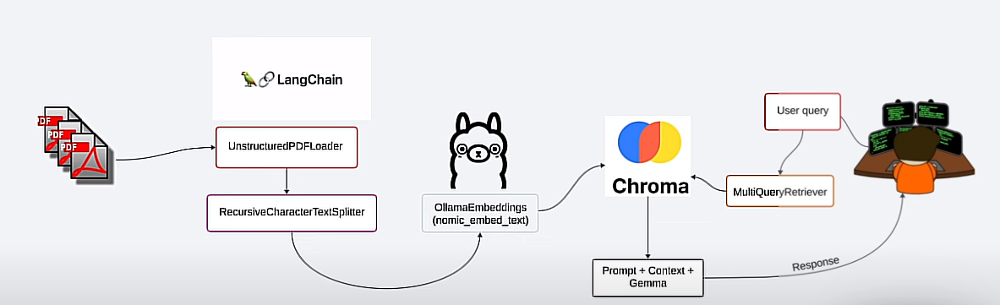

# rag_application2

## Steps

1. Load Data and give system prompt
2. Initialized HuggingFaceLLM with various parameters.
3. Used service context to divide chunk size and implimented vector store index.
4. Initialized querry engine

## With Ollama

